# 🏗️ CollabCanvas Architecture

## Table of Contents

- [System Overview](#system-overview)
- [Component Architecture](#component-architecture)
- [Data Flow](#data-flow)
- [WebSocket Protocol](#websocket-protocol)
- [Database Schema](#database-schema)
- [Security Architecture](#security-architecture)
- [Deployment Architecture](#deployment-architecture)
- [Performance Optimizations](#performance-optimizations)

---

## System Overview

CollabCanvas is built as a modern, scalable real-time collaborative application using microservices architecture.

### High-Level Architecture


---

## Component Architecture

### Frontend Architecture


### Backend Architecture


---

## Data Flow

### Object Creation Flow


### AI Command Flow


### Authentication Flow


---

## WebSocket Protocol

### Message Types

```mermaid
graph LR
    subgraph "Client → Server"
        A[auth]
        B[object.create]
        C[object.update]
        D[object.delete]
        E[presence.cursor]
    end

    subgraph "Server → Client"
        F[auth.success]
        G[auth.error]
        H[initialState]
        I[object.create]
        J[object.update]
        K[object.delete]
        L[presence.join]
        M[presence.cursor]
        N[presence.leave]
        O[error]
    end

    style A fill:#10a37f
    style F fill:#4caf50
    style G fill:#f44336
```



### Message Format

```typescript
// Base Message
interface WSMessage {
  type: MessageType
  timestamp: string
  [key: string]: any
}

// Object Create
{
  type: 'object.create',
  object: {
    id: string,
    type: 'rectangle' | 'circle' | ...,
    x: number,
    y: number,
    width: number,
    height: number,
    color: string,
    rotation: number,
    zIndex: number,
    createdBy: string,
    createdAt: string
  },
  timestamp: string
}

// Object Update
{
  type: 'object.update',
  id: string,
  updates: {
    x?: number,
    y?: number,
    width?: number,
    height?: number,
    rotation?: number,
    color?: string
  },
  timestamp: string
}

// Presence Update
{
  type: 'presence.cursor',
  userId: string,
  userName: string,
  cursor: {
    x: number,
    y: number
  },
  timestamp: string
}
```

---

## Database Schema

### DynamoDB Tables

```mermaid
erDiagram
    PROJECTS ||--o{ OBJECTS : contains
    PROJECTS ||--o{ COLLABORATORS : has
    PROJECTS {
        string id PK
        string name
        string ownerId
        array collaborators
        string createdAt
        string updatedAt
    }

    OBJECTS {
        string id PK
        string projectId SK
        string type
        number x
        number y
        number width
        number height
        string color
        number rotation
        number zIndex
        string createdBy
        string createdAt
    }

    COLLABORATORS {
        string email
        string role
    }
```

### Table Definitions

#### Projects Table
```
Table: collabcanvas-projects
Partition Key: id (String)
Attributes:
  - name: String
  - ownerId: String
  - collaborators: List<Map>
    - email: String
    - role: String (owner|editor|viewer)
  - createdAt: String (ISO 8601)
  - updatedAt: String (ISO 8601)

Indexes:
  - GSI1: ownerId-createdAt-index
    - Partition Key: ownerId
    - Sort Key: createdAt
```

#### Objects Table
```
Table: collabcanvas-objects
Partition Key: projectId (String)
Sort Key: id (String)
Attributes:
  - type: String
  - x: Number
  - y: Number
  - width: Number
  - height: Number
  - color: String
  - rotation: Number
  - zIndex: Number
  - text?: String
  - fontSize?: Number
  - points?: List<Number>
  - createdBy: String
  - createdAt: String (ISO 8601)

Indexes:
  - GSI1: projectId-zIndex-index
    - Partition Key: projectId
    - Sort Key: zIndex
```

---

## Security Architecture

### Authentication & Authorization


### Role-Based Access Control (RBAC)

| Operation | Owner | Editor | Viewer |
|-----------|-------|--------|--------|
| View Canvas | ✅ | ✅ | ✅ |
| Create Objects | ✅ | ✅ | ❌ |
| Edit Objects | ✅ | ✅ | ❌ |
| Delete Objects | ✅ | ✅ | ❌ |
| Edit Project Details | ✅ | ❌ | ❌ |
| Manage Collaborators | ✅ | ❌ | ❌ |
| Delete Project | ✅ | ❌ | ❌ |

---

## Deployment Architecture

### AWS Infrastructure


### Container Architecture


---

## Performance Optimizations

### Frontend Optimizations

```mermaid
graph TB
    subgraph "Bundle Optimization"
        A[Code Splitting]
        B[Lazy Loading Routes]
        C[Vendor Chunking]
        D[Tree Shaking]
        E[Minification]
    end

    subgraph "Runtime Optimization"
        F[Object Virtualization]
        G[Viewport Culling]
        H[Component Memoization]
        I[Debounced Updates]
        J[Adaptive Grid]
    end

    subgraph "Caching Strategy"
        K[Service Worker]
        L[Asset Caching]
        M[API Response Cache]
    end

    subgraph "Results"
        N[Bundle: 805KB → 189KB]
        O[Load: 3s → 0.8s]
        P[FPS: 60 sustained]
    end

    A --> N
    B --> N
    C --> N
    D --> N
    E --> N
    F --> O
    G --> O
    H --> P
    I --> P
    J --> P

    style N fill:#4caf50
    style O fill:#4caf50
    style P fill:#4caf50
```



### Object Virtualization


### Auto-Save Strategy


---

## Technology Decisions

### Why WebSocket over HTTP Polling?

- **Latency**: <50ms vs 500ms+
- **Bandwidth**: 90% reduction
- **Real-time**: True real-time updates
- **Scalability**: Better connection management

### Why DynamoDB over PostgreSQL?

- **Scalability**: Auto-scaling with traffic
- **Performance**: Single-digit ms latency
- **Cost**: Pay-per-use model
- **Serverless**: No infrastructure management

### Why Konva.js over Canvas API?

- **Performance**: Hardware-accelerated
- **Features**: Built-in transforms, events
- **Developer Experience**: React integration
- **Battle-tested**: Used by Figma, Canva

### Why React over Vue/Svelte?

- **Ecosystem**: Largest component library
- **Team Expertise**: Industry standard
- **TypeScript**: First-class support
- **Performance**: Virtual DOM optimization

---

## Monitoring & Observability

### Metrics Collected

- **WebSocket**: Connection count, message rate
- **Canvas**: Object count, render FPS
- **API**: Request latency, error rate
- **DynamoDB**: Read/write capacity units

### Health Checks

```
GET /health
Response: {
  status: "healthy",
  uptime: 12345,
  websocket: {
    connections: 42
  }
}
```

---

## Future Architecture Considerations

1. **Redis for Presence**: Move presence to Redis for better scalability
2. **S3 for Assets**: Store canvas thumbnails in S3
3. **CloudFront**: Add CloudFront for global CDN
4. **Aurora Serverless**: Consider for complex queries
5. **Lambda@Edge**: For edge computing needs
6. **ElastiCache**: For caching frequent queries

---

**Architecture designed for scale, performance, and developer experience** 🚀

