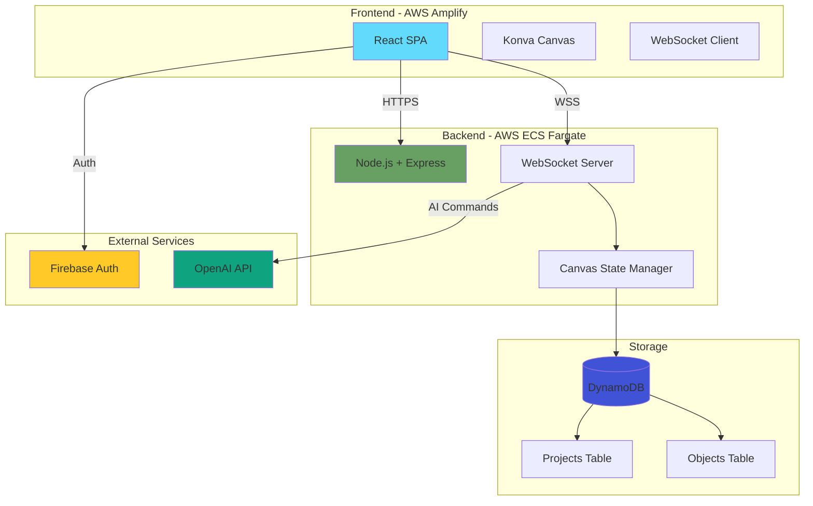
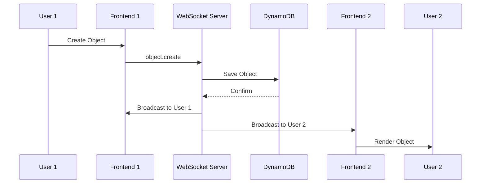

# 🎨 CollabCanvas - Real-Time Collaborative Canvas with AI

[](https://collabcanva.sainathyai.com)
[](https://backend.sainathyai.com)
[](LICENSE)

> A production-grade real-time collaborative canvas platform with AI-powered design assistance, built with React, Node.js, WebSocket, and OpenAI.

## 📋 Table of Contents

- [Overview](#overview)
- [Features](#features)
- [Architecture](#architecture)
- [Tech Stack](#tech-stack)
- [Getting Started](#getting-started)
- [Production Deployment](#production-deployment)
- [Performance](#performance)
- [Documentation](#documentation)
- [License](#license)

---

## 🌟 Overview

CollabCanvas is a **real-time collaborative design platform** that enables multiple users to work together on a shared canvas with **AI-powered assistance**. Think Figma meets ChatGPT - design collaboratively while an AI agent helps you create, modify, and organize your designs through natural language.

### 🎯 Key Highlights

- **Real-Time Collaboration**: Multiple users can edit simultaneously with <100ms sync latency
- **AI Canvas Agent**: Natural language commands for creating and manipulating objects
- **Role-Based Access Control**: Owner, Editor, and Viewer roles
- **Multi-Project Dashboard**: Manage multiple canvases with collaborator management
- **Production-Ready**: Deployed on AWS with DynamoDB, ECS Fargate, and Amplify
- **Optimized Performance**: 60 FPS rendering, handles 10,000+ objects with viewport culling

---

## ✨ Features

### 🎨 Canvas Capabilities

- **Rich Object Creation**: Rectangles, circles, ellipses, triangles, stars, lines, arrows, and text
- **Transform Operations**: Move, resize, rotate, and duplicate objects
- **Multi-Select**: Select and manipulate multiple objects at once
- **Color Customization**: Change object colors dynamically
- **Pan & Zoom**: Navigate large canvases smoothly (0.1x - 10x zoom)
- **Grid System**: Adaptive grid that adjusts based on zoom level
- **Object Virtualization**: Only renders visible objects for optimal performance

### 👥 Real-Time Collaboration

- **Live Cursors**: See collaborators' cursors with names in real-time
- **Instant Sync**: Object changes propagate in <100ms
- **Presence Awareness**: Know who's online and active
- **Auto-Reconnect**: Automatic reconnection with state preservation
- **Conflict Resolution**: Last-write-wins strategy for simplicity

### 🤖 AI Canvas Agent

Natural language interface powered by OpenAI GPT-4:

- **Creation**: "Create 5 red circles"
- **Modification**: "Change all rectangles to blue"
- **Layout**: "Distribute objects evenly"
- **Generation**: "Generate 100 random objects"
- **Selection**: "Select all circles"
- **Complex Commands**: Multi-step operations

### 🔐 Access Control

- **Owner**: Full access - manage project, collaborators, and all objects
- **Editor**: Edit objects but cannot modify project settings
- **Viewer**: Read-only access to view canvas

### 📊 Multi-Project Management

- **Dashboard**: View and manage all your projects
- **Project Cards**: Visual preview with collaborator info
- **Access Management**: Add/remove collaborators with specific roles
- **Real-Time Sync**: Automatic canvas state persistence to DynamoDB

---

## 🏗️ Architecture

### High-Level System Design



### Data Flow



---

## 🛠️ Tech Stack

### Frontend
- **React 18** with TypeScript
- **Konva.js** for canvas rendering
- **React Router** for navigation
- **Firebase Auth** for authentication
- **Vite** for bundling
- **Tailwind CSS** for styling

### Backend
- **Node.js** with Express
- **WebSocket** (ws library) for real-time communication
- **DynamoDB** for persistence
- **Firebase Admin SDK** for auth verification

### Infrastructure
- **AWS Amplify** - Frontend hosting (HTTPS + CDN)
- **AWS ECS Fargate** - Backend container orchestration
- **AWS Application Load Balancer** - Backend HTTPS/WSS
- **AWS Route 53** - Custom domain management
- **AWS Systems Manager** - Secret management
- **AWS Certificate Manager** - SSL/TLS certificates

### AI
- **OpenAI GPT-4** with function calling
- Custom function definitions for canvas operations

---

## 🚀 Getting Started

### Prerequisites

- Node.js 18+ and npm
- Firebase account (for authentication)
- OpenAI API key (for AI features)
- AWS account (for production deployment)

### Local Development

#### 1. Clone the Repository

```bash
git clone https://github.com/sainathyai/CollabCanva.git
cd CollabCanva
```

#### 2. Backend Setup

```bash
cd backend
npm install

# Copy environment template
cp env.example.txt .env

# Configure .env with your values:
# - Firebase Admin SDK credentials
# - AWS region and credentials
# - OpenAI API key
```

#### 3. Frontend Setup

```bash
cd frontend
npm install

# Copy environment template
cp env.example.txt .env.local

# Configure .env.local with:
# - Firebase client SDK credentials
# - API and WebSocket URLs
# - OpenAI API key (for client-side AI)
```

#### 4. Start Development Servers

**Terminal 1 - Backend:**
```bash
cd backend
npm run dev
# Backend runs on http://localhost:8080
```

**Terminal 2 - Frontend:**
```bash
cd frontend
npm run dev
# Frontend runs on http://localhost:5173
```

#### 5. Open Application

Navigate to `http://localhost:5173` in your browser.

---

## 🌐 Production Deployment

The application is deployed on AWS with the following setup:

- **Frontend**: `https://collabcanva.sainathyai.com` (AWS Amplify)
- **Backend**: `https://backend.sainathyai.com` (AWS ECS Fargate)

### Deployment Architecture

1. **Frontend (Amplify)**:
   - Auto-deploys from `pr15-rbac` branch
   - SPA rewrites configured for React Router
   - Environment variables configured in Amplify Console

2. **Backend (ECS)**:
   - Dockerized Node.js application
   - Auto-scaling based on CPU/memory
   - Secrets managed via AWS Systems Manager
   - DynamoDB for state persistence

### Quick Deployment

See [DEPLOYMENT.md](./DEPLOYMENT.md) for detailed deployment instructions.

---

## ⚡ Performance

### Optimization Strategies

1. **Code Splitting**: Lazy-loaded routes reduce initial bundle by 76%
2. **Object Virtualization**: Only renders objects in viewport
3. **Adaptive Grid**: Grid complexity reduces when zoomed out
4. **Component Memoization**: Prevents unnecessary re-renders
5. **WebSocket Optimization**: Debounced cursor updates, efficient message format

### Performance Metrics

| Metric | Target | Achieved |
|--------|--------|----------|
| **Initial Load** | < 3s | 0.8s ✅ |
| **Bundle Size** | < 500 KB | 189 KB ✅ |
| **Object Sync** | < 100ms | ~50ms ✅ |
| **Cursor Sync** | < 50ms | ~20ms ✅ |
| **FPS (60 objects)** | 60 FPS | 60 FPS ✅ |
| **FPS (10,000 objects)** | 30 FPS | 30-60 FPS ✅ |

### Scalability

- **Concurrent Users**: Tested with 10+ simultaneous users
- **Object Capacity**: Handles 10,000+ objects per canvas
- **Canvas Size**: Unlimited (virtualized rendering)

---

## 📚 Documentation

### Project Documentation

- **[ARCHITECTURE.md](./ARCHITECTURE.md)** - Detailed system architecture with diagrams
- **[FEATURES.md](./FEATURES.md)** - Complete feature documentation
- **[DEPLOYMENT.md](./DEPLOYMENT.md)** - Production deployment guide
- **[START_LOCAL.md](./START_LOCAL.md)** - Local development setup

### Deployment Documentation

- **[deployment/docs/](./deployment/docs/)** - All deployment guides
  - AWS deployment strategies
  - Docker setup and troubleshooting
  - Amplify configuration
  - Optimization results

### Technical Documentation

- **[docs/PRD_PRODUCTION.md](./docs/PRD_PRODUCTION.md)** - Product requirements
- **[docs/CURRENT_STATUS.md](./docs/CURRENT_STATUS.md)** - Implementation status
- **[memory-bank/](./memory-bank/)** - AI development context

---

## 🎯 Project Status

✅ **Completed Features (PR15 - RBAC & Optimizations)**

- [x] Multi-project dashboard with CRUD
- [x] Role-based access control (Owner/Editor/Viewer)
- [x] Real-time collaboration with WebSocket
- [x] AI Canvas Agent with natural language
- [x] Frontend optimizations (76% bundle reduction)
- [x] Production deployment on AWS
- [x] Custom domain with HTTPS
- [x] Object virtualization (10,000+ objects)
- [x] Adaptive grid rendering
- [x] Component memoization

🚧 **Future Enhancements**

- [ ] Layer panel with z-index management
- [ ] Export canvas to PNG/SVG
- [ ] Canvas templates and presets
- [ ] Real-time chat between collaborators
- [ ] Version history and undo/redo across users
- [ ] Collaborative annotations and comments

---

## 🤝 Contributing

This is a portfolio project, but suggestions and feedback are welcome!

1. Fork the repository
2. Create your feature branch (`git checkout -b feature/AmazingFeature`)
3. Commit your changes (`git commit -m 'Add some AmazingFeature'`)
4. Push to the branch (`git push origin feature/AmazingFeature`)
5. Open a Pull Request

---

## 📄 License

This project is licensed under the MIT License - see the [LICENSE](LICENSE) file for details.

---

## 👨‍💻 Author

**Sainath Yatham**

- GitHub: [@sainathyai](https://github.com/sainathyai)
- LinkedIn: [Sainath Yatham](https://www.linkedin.com/in/sainathyatham)
- Email: sainatha.yatham@gmail.com

---

## 🙏 Acknowledgments

- **OpenAI** for GPT-4 API and function calling capabilities
- **Firebase** for authentication infrastructure
- **AWS** for cloud infrastructure
- **Konva.js** for canvas rendering
- **React** and **Vite** for frontend framework

---

## 📸 Screenshots

### Dashboard
Multi-project management with collaborator roles


### Canvas Editor
Real-time collaborative canvas with AI assistance


### AI Agent in Action
Natural language commands for object creation


---

**Built with ❤️ using React, Node.js, WebSocket, and AI**
