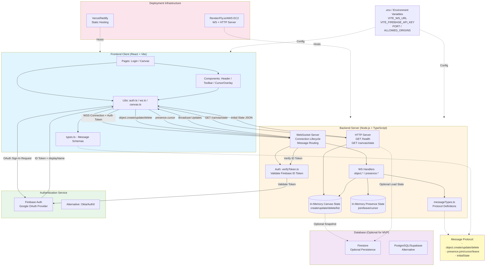

# CollabCanvas MVP - Architecture Diagram

This diagram illustrates the complete architecture including all core components, client-server communications, authentication flow, and technologies used in the MVP.

## Key Components

### Frontend (React + Vite)
- **Pages**: Login, Canvas
- **Components**: Header, Toolbar, CursorOverlay
- **Core Libraries**: 
  - `auth.ts`: Firebase Auth integration
  - `ws.ts`: WebSocket client with reconnection
  - `canvas.ts`: Canvas helpers and transformations

### Backend (Node.js)
- **HTTP API**: Health check and initial canvas state
- **WebSocket Server**: Real-time synchronization
- **State Management**: In-memory canvas objects and presence registry
- **Auth Verification**: Firebase ID token validation

### External Services
- **Authentication**: Firebase Auth (Google OAuth) or Okta/Auth0
- **Database**: Optional Firestore or PostgreSQL for persistence

### Deployment
- **Frontend**: Vercel or Netlify
- **Backend**: Render, Fly.io, or AWS EC2

## Message Protocol
- `object.create/update/delete`: Canvas object manipulation
- `presence.join/cursor/leave`: User presence tracking
- `initialState`: Canvas hydration on connection

