# CollabCanvas - Detailed Architecture

**Production URLs:**
- Frontend: https://collab-canva-jdte.vercel.app
- Backend: https://collabcanva-backend.onrender.com
- GitHub: https://github.com/sainathyai/CollabCanva

---

## Complete System Architecture

```mermaid
flowchart TB
    subgraph Browsers["👥 User Browsers (Chrome, Firefox, Safari)"]
        U1[User 1 Browser]
        U2[User 2 Browser]
        U3[User N Browser]
    end

    subgraph Vercel["☁️ Vercel (Frontend Hosting)"]
        direction TB
        subgraph FrontendApp["React + Vite Application"]
            direction TB

            subgraph Pages["📄 Pages"]
                Login[Login.tsx<br/>Firebase OAuth UI]
                Canvas[Canvas.tsx<br/>Main Canvas + WebSocket]
            end

            subgraph Components["🧩 Components"]
                Header[Header.tsx<br/>User name + Logout]
                Toolbar[Toolbar.tsx<br/>Add Rectangle button]
                CursorOverlay[CursorOverlay.tsx<br/>Other users' cursors]
            end

            subgraph Libs["📚 Libraries"]
                AuthLib[auth.ts<br/>Firebase SDK<br/>signIn/signOut/getCurrentUser]
                WSClient[ws.ts<br/>WebSocket Client<br/>Singleton + Reconnection]
                CanvasLib[canvas.ts<br/>Drawing utilities<br/>Transformations]
            end

            subgraph Types["📋 Types"]
                TypeDefs[types.ts<br/>CanvasObject<br/>Presence<br/>WSMessage]
            end
        end

        Router[Router.tsx<br/>Route Protection]
        MainEntry[main.tsx<br/>App Entry]

        MainEntry --> Router
        Router --> Login
        Router --> Canvas
        Canvas --> Header
        Canvas --> Toolbar
        Canvas --> CursorOverlay
        Canvas --> WSClient
        Canvas --> CanvasLib
        Login --> AuthLib
        Header --> AuthLib
        WSClient --> TypeDefs
        Canvas --> TypeDefs
    end

    subgraph Render["☁️ Render (Backend Hosting)"]
        direction TB
        subgraph BackendApp["Node.js + TypeScript Server"]
            direction TB

            ServerEntry[server.ts<br/>HTTP + WebSocket Servers<br/>Port 8080]

            subgraph HTTP["🌐 HTTP Endpoints"]
                Health[GET /health<br/>Health Check]
            end

            subgraph WebSocket["🔌 WebSocket Server"]
                WSServer[ws/index.ts<br/>WebSocket Server Init<br/>Connection Management]
                WSHandlers[ws/handlers.ts<br/>Message Router<br/>handleAuth<br/>handleObjectCreate<br/>handleObjectUpdate<br/>handleObjectDelete<br/>handlePresenceCursor]
                MessageTypes[ws/messageTypes.ts<br/>Message Interfaces<br/>Protocol Definitions]
            end

            subgraph Auth["🔐 Authentication"]
                VerifyToken[auth/verifyToken.ts<br/>Firebase Admin SDK<br/>Token Verification]
            end

            subgraph State["💾 In-Memory State"]
                CanvasState[(canvasState.ts<br/>Array of CanvasObject<br/>add/update/delete/getAll)]
                PresenceState[(presenceState.ts<br/>Map of Presence<br/>join/leave/updateCursor)]
            end

            subgraph Utils["🛠️ Utilities"]
                Logger[logger.ts<br/>Structured Logging]
                Env[env.ts<br/>Environment Validation]
            end
        end

        ServerEntry --> HTTP
        ServerEntry --> WSServer
        WSServer --> WSHandlers
        WSHandlers --> MessageTypes
        WSHandlers --> VerifyToken
        WSHandlers --> CanvasState
        WSHandlers --> PresenceState
        WSHandlers --> Logger
        ServerEntry --> Env
    end

    subgraph Firebase["🔥 Firebase (Google Cloud)"]
        direction TB
        FirebaseAuth[Firebase Authentication<br/>Project: collabcanva-730db<br/>Google OAuth Provider]
        FirebaseAdmin[Firebase Admin SDK<br/>Token Verification API]
    end

    %% User Interactions
    U1 --> |HTTPS| Vercel
    U2 --> |HTTPS| Vercel
    U3 --> |HTTPS| Vercel

    %% Authentication Flow
    AuthLib -->|"1️⃣ OAuth Sign-In Request"| FirebaseAuth
    FirebaseAuth -->|"2️⃣ ID Token + User Info"| AuthLib
    WSClient -->|"3️⃣ WebSocket Auth Message<br/>{type: 'auth', token: '...'}"| WSServer
    VerifyToken -->|"4️⃣ Verify ID Token"| FirebaseAdmin
    FirebaseAdmin -->|"5️⃣ Valid/Invalid"| VerifyToken
    WSHandlers -->|"6️⃣ auth.success/auth.error"| WSClient

    %% WebSocket Connection
    WSClient -.->|"WSS Connection<br/>wss://collabcanva-backend.onrender.com"| WSServer

    %% Object Operations
    Canvas -->|"object.create<br/>{type, object: {...}}"| WSClient
    Canvas -->|"object.update<br/>{type, object: {id, x, y}}"| WSClient
    Canvas -->|"object.delete<br/>{type, objectId: '...'}"| WSClient
    WSClient -->|"WebSocket Messages"| WSHandlers
    WSHandlers -->|"Broadcast to Others"| WSServer
    WSServer -.->|"Broadcast Updates"| WSClient

    %% Presence/Cursor Updates
    Canvas -->|"presence.cursor<br/>{type, x, y}<br/>(throttled 60 FPS)"| WSClient
    WSHandlers -->|"Update Presence"| PresenceState
    WSHandlers -->|"Broadcast Cursor"| WSServer

    %% State Management
    WSHandlers -->|"Add/Update/Delete"| CanvasState
    WSHandlers -->|"Join/Leave/Cursor"| PresenceState
    WSHandlers -->|"On Connect: Send Initial State"| WSClient
    CanvasState -->|"Get All Objects"| WSHandlers
    PresenceState -->|"Get All Users"| WSHandlers

    %% HTTP Health Check
    Health -.->|"Health Status JSON"| U1

    %% Styling
    style Browsers fill:#e3f2fd
    style Vercel fill:#c8e6c9
    style Render fill:#fff9c4
    style Firebase fill:#ffccbc
    style FrontendApp fill:#e8f5e9
    style BackendApp fill:#fff3e0
    style WebSocket fill:#e1bee7
    style State fill:#b3e5fc
    style Auth fill:#ffcdd2
```



---

## Message Protocol Flow

```mermaid
sequenceDiagram
    participant Browser as 👤 User Browser
    participant Frontend as React App
    participant WebSocket as WSS Connection
    participant Backend as Backend Server
    participant State as In-Memory State
    participant Firebase as Firebase Auth

    %% Authentication Flow
    rect rgb(200, 230, 201)
        Note over Browser,Firebase: 🔐 Authentication Flow
        Browser->>Frontend: Click "Sign in with Google"
        Frontend->>Firebase: OAuth Request
        Firebase-->>Frontend: ID Token + User Info
        Frontend->>Frontend: Store user locally
        Frontend->>WebSocket: Connect to wss://...
        WebSocket->>Backend: WebSocket Open
        Frontend->>WebSocket: {type: 'auth', token: 'eyJ...'}
        Backend->>Firebase: Verify Token
        Firebase-->>Backend: Token Valid ✓
        Backend->>Backend: Store user claims
        Backend->>WebSocket: {type: 'auth.success', userId: '...'}
        WebSocket-->>Frontend: Auth Success
        Backend->>State: Get canvas state
        State-->>Backend: All objects + presence
        Backend->>WebSocket: {type: 'initialState', objects: [...], presence: [...]}
        WebSocket-->>Frontend: Initial State
        Frontend->>Frontend: Render canvas + cursors
    end

    %% Object Creation
    rect rgb(255, 243, 224)
        Note over Browser,State: ➕ Create Object
        Browser->>Frontend: Click "Add Rectangle"
        Frontend->>Frontend: Optimistic: Add to local state
        Frontend->>WebSocket: {type: 'object.create', object: {...}}
        WebSocket->>Backend: Message received
        Backend->>Backend: Verify authenticated
        Backend->>State: Add object
        State-->>Backend: Object added ✓
        Backend->>Backend: Broadcast to others
        Backend-->>Frontend: {type: 'object.create', object: {...}}
        Frontend->>Frontend: Update canvas
    end

    %% Cursor Movement
    rect rgb(225, 190, 231)
        Note over Browser,State: 🖱️ Cursor Movement
        Browser->>Frontend: Mouse move
        Frontend->>Frontend: Throttle (16ms)
        Frontend->>WebSocket: {type: 'presence.cursor', x, y}
        WebSocket->>Backend: Cursor update
        Backend->>State: Update user position
        Backend->>Backend: Broadcast to others
        Backend-->>Frontend: {type: 'presence.cursor', userId, x, y}
        Frontend->>Frontend: Update CursorOverlay
    end

    %% Object Update (Drag)
    rect rgb(255, 249, 196)
        Note over Browser,State: ✏️ Update Object (Drag)
        Browser->>Frontend: Drag object
        Frontend->>Frontend: Update local position
        Frontend->>WebSocket: {type: 'object.update', object: {id, x, y}}
        WebSocket->>Backend: Update message
        Backend->>State: Update object position
        Backend->>Backend: Broadcast to others
        Backend-->>Frontend: {type: 'object.update', object: {...}}
        Frontend->>Frontend: Update canvas
    end

    %% Object Deletion
    rect rgb(255, 205, 210)
        Note over Browser,State: 🗑️ Delete Object
        Browser->>Frontend: Press Delete key
        Frontend->>Frontend: Remove from local state
        Frontend->>WebSocket: {type: 'object.delete', objectId: '...'}
        WebSocket->>Backend: Delete message
        Backend->>State: Delete object
        Backend->>Backend: Broadcast to others
        Backend-->>Frontend: {type: 'object.delete', objectId: '...'}
        Frontend->>Frontend: Remove from canvas
    end

    %% Disconnection
    rect rgb(240, 240, 240)
        Note over Browser,State: 🔌 User Disconnects
        Browser->>Frontend: Close tab / Network issue
        Frontend->>WebSocket: Connection closed
        WebSocket->>Backend: WebSocket close event
        Backend->>Backend: Get user from connectedClients
        Backend->>Backend: Remove from connectedClients
        Backend->>State: Remove presence
        Backend->>Backend: Broadcast presence.leave
        Backend-->>Frontend: {type: 'presence.leave', userId: '...'}
        Frontend->>Frontend: Remove cursor from overlay
    end
```



---

## Deployment Architecture

```mermaid
flowchart LR
    subgraph Dev["💻 Development (Local)"]
        DevFE[Frontend<br/>localhost:5173<br/>npm run dev]
        DevBE[Backend<br/>localhost:8080<br/>npm run dev]
    end

    subgraph Prod["🌐 Production"]
        direction TB

        subgraph Git["GitHub Repository"]
            MainBranch[main branch<br/>sainathyai/CollabCanva]
        end

        subgraph VercelDeploy["Vercel Deployment"]
            VercelBuild["Build Process<br/>1. npm install<br/>2. npm run build<br/>3. Output: dist/"]
            VercelCDN["Global CDN<br/>Static Assets<br/>HTTPS"]
            ProdFE["🌐 Production Frontend<br/>collab-canva-jdte.vercel.app"]
        end

        subgraph RenderDeploy["Render Deployment"]
            RenderBuild["Build Process<br/>1. npm ci --include=dev<br/>2. npm run build<br/>3. Output: dist/"]
            RenderServer["Node.js Runtime<br/>WebSocket Server<br/>Port 8080"]
            ProdBE["🌐 Production Backend<br/>collabcanva-backend.onrender.com"]
        end

        Git -->|Auto Deploy on Push| VercelDeploy
        Git -->|Auto Deploy on Push| RenderDeploy
        VercelBuild --> VercelCDN
        VercelCDN --> ProdFE
        RenderBuild --> RenderServer
        RenderServer --> ProdBE
    end

    subgraph Ext["External Services"]
        FirebaseProd["Firebase Auth<br/>collabcanva-730db<br/>Google OAuth"]
    end

    DevFE -.->|ws://localhost:8080| DevBE
    DevFE -.->|Test Auth| FirebaseProd
    ProdFE -->|wss://collabcanva-backend.onrender.com| ProdBE
    ProdFE -->|OAuth| FirebaseProd
    ProdBE -->|Verify Tokens| FirebaseProd

    style Dev fill:#e3f2fd
    style Prod fill:#c8e6c9
    style Ext fill:#ffccbc
    style Git fill:#fff9c4
```



---

## Key Components Breakdown

### Frontend (React + Vite)

| Component | File | Purpose |
|-----------|------|---------|
| **Entry** | `main.tsx` | React root, renders App |
| **Router** | `routes/Router.tsx` | Route protection, navigation |
| **Pages** | `pages/Login.tsx` | Firebase Google OAuth UI |
| | `pages/Canvas.tsx` | Main canvas with WebSocket integration |
| **Components** | `components/Header.tsx` | Display name, logout button |
| | `components/Toolbar.tsx` | Add Rectangle button |
| | `components/CursorOverlay.tsx` | Render other users' cursors |
| **Libraries** | `lib/auth.ts` | Firebase SDK, auth helpers |
| | `lib/ws.ts` | WebSocket client singleton |
| | `lib/canvas.ts` | Canvas drawing utilities |
| **Types** | `types.ts` | Shared TypeScript interfaces |

### Backend (Node.js + TypeScript)

| Component | File | Purpose |
|-----------|------|---------|
| **Entry** | `server.ts` | HTTP + WebSocket server initialization |
| **HTTP** | `http/health.ts` | Health check endpoint |
| **WebSocket** | `ws/index.ts` | WebSocket server setup |
| | `ws/handlers.ts` | Message routing and handlers |
| | `ws/messageTypes.ts` | Message protocol definitions |
| **Auth** | `auth/verifyToken.ts` | Firebase Admin SDK token verification |
| **State** | `state/canvasState.ts` | In-memory canvas objects storage |
| | `state/presenceState.ts` | In-memory user presence tracking |
| **Utils** | `utils/logger.ts` | Structured logging |
| | `env.ts` | Environment variable validation |

---

## Message Types

### Client → Server

```typescript
// Authentication
{ type: 'auth', token: string }

// Object Operations
{ type: 'object.create', object: CanvasObject }
{ type: 'object.update', object: Partial<CanvasObject> & { id: string } }
{ type: 'object.delete', objectId: string }

// Presence
{ type: 'presence.cursor', x: number, y: number }
```

### Server → Client

```typescript
// Authentication Response
{ type: 'auth.success', userId: string, displayName?: string }
{ type: 'auth.error', error: string }

// Initial State
{ type: 'initialState', objects: CanvasObject[], presence?: Presence[] }

// Object Operations (Broadcast)
{ type: 'object.create', object: CanvasObject, timestamp: string }
{ type: 'object.update', object: Partial<CanvasObject>, timestamp: string }
{ type: 'object.delete', objectId: string, timestamp: string }

// Presence (Broadcast)
{ type: 'presence.join', presence: Presence }
{ type: 'presence.cursor', userId: string, x: number, y: number }
{ type: 'presence.leave', userId: string }

// Errors
{ type: 'error', error: string }
```

---

## State Management

### Backend In-Memory State

```typescript
// Canvas Objects
const canvasObjects: CanvasObject[] = [
  {
    id: "uuid-1",
    type: "rectangle",
    x: 100,
    y: 100,
    width: 200,
    height: 150,
    fill: "#3B82F6",
    createdBy: "user-id-1",
    createdAt: "2025-10-14T...",
    updatedAt: "2025-10-14T..."
  }
]

// User Presence
const presenceMap: Map<string, Presence> = new Map([
  ["user-id-1", {
    userId: "user-id-1",
    displayName: "John Doe",
    x: 450,
    y: 320,
    color: "#FF5733",
    lastSeen: 1697234567890
  }]
])

// Connected Clients
const connectedClients: Map<WebSocket, UserClaims> = new Map([
  [wsConnection1, { uid: "user-id-1", email: "john@example.com", name: "John Doe" }]
])
```

### Frontend State (React)

```typescript
// Canvas.tsx
const [objects, setObjects] = useState<CanvasObject[]>([])
const [presences, setPresences] = useState<Map<string, Presence>>(new Map())
const [selectedObjectId, setSelectedObjectId] = useState<string | null>(null)
const [isConnected, setIsConnected] = useState(false)
const [isAuthenticated, setIsAuthenticated] = useState(false)
```

---

## Performance Optimizations

### 1. Cursor Throttling
- **Rate**: 60 updates/second (16ms throttle)
- **Why**: Prevent WebSocket flooding
- **Implementation**: `lastCursorUpdate.current` timestamp check

### 2. Optimistic UI Updates
- **Pattern**: Update local state immediately, sync with server
- **Benefit**: Feels instant to user
- **Trade-off**: Possible inconsistency if server rejects

### 3. Canvas Rendering
- **Trigger**: Only on state changes (useEffect dependencies)
- **Optimization**: Could add dirty region tracking
- **Current**: Full canvas redraw acceptable for MVP

### 4. WebSocket Reconnection
- **Strategy**: Exponential backoff (1s, 2s, 4s, 8s, 16s)
- **Max Retries**: 5 attempts
- **State Sync**: Full state refresh on reconnection

---

## Security Measures

### ✅ Implemented

1. **Firebase Token Verification**
   - Server verifies every token with Firebase Admin SDK
   - No client-side trust

2. **CORS Configuration**
   - Backend only accepts connections from allowed origins
   - Environment variable: `ALLOWED_ORIGINS`

3. **WebSocket Authentication**
   - Must authenticate before any operations
   - `connectedClients` Map tracks authenticated users

4. **HTTPS/WSS**
   - All production traffic encrypted
   - `wss://` for WebSocket, `https://` for HTTP

5. **Environment Variables**
   - Secrets not committed to Git
   - `.env.example` for reference only

### ⚠️ Not Implemented (Acceptable for MVP)

- Rate limiting (relying on Render/Vercel infrastructure)
- Input sanitization (rectangles only, no user content)
- DDoS protection (free tier limitations acceptable)

---

## Known Limitations

### By Design (MVP Scope)

1. **In-Memory State**
   - Objects lost on server restart
   - Acceptable: Learning project, no persistence required

2. **Single Canvas**
   - All users share one canvas
   - No rooms or sessions
   - Acceptable: Simplified scope

3. **No Conflict Resolution**
   - Last-write-wins for simultaneous updates
   - Acceptable: Low probability with small user count

4. **Cold Starts (Render Free Tier)**
   - 30-60 second startup after 15 min idle
   - Acceptable: User sees "Connecting..." message

### Could Be Improved

- Persistent storage (Firestore/PostgreSQL)
- Multiple canvas rooms
- Operational Transformation or CRDT for conflict resolution
- Paid hosting for no cold starts

---

## Comparison: Current vs. Original Plan

| Aspect | Original Plan | Current Implementation | Status |
|--------|---------------|------------------------|--------|
| Frontend Framework | React + Vite | ✅ React + Vite | Matched |
| Backend Runtime | Node.js + TypeScript | ✅ Node.js + TypeScript | Matched |
| Authentication | Firebase Auth or Okta | ✅ Firebase Auth (Google OAuth) | Matched |
| Database | Optional Firestore | ⚠️ In-memory only | Simplified (acceptable) |
| Frontend Deployment | Vercel/Netlify | ✅ Vercel | Matched |
| Backend Deployment | Render/Fly.io/AWS | ✅ Render | Matched |
| Real-time Protocol | WebSocket | ✅ WebSocket (ws library) | Matched |
| Presence Feature | Live cursors | ✅ Live cursors with names | Matched + Enhanced |
| Object Operations | Create/Move/Delete | ✅ Create/Move/Delete | Matched |
| Message Protocol | Type-based | ✅ TypeScript enums | Matched |

### Summary
✅ **100% of core features implemented**
✅ **All architecture decisions followed**
⚠️ **Simplified database (in-memory acceptable for MVP)**
🎉 **Production deployed and working**

---

## Next Steps (Beyond MVP)

If continuing development:

1. **Add Persistence**
   - Integrate Firestore or PostgreSQL
   - Save canvas state periodically
   - Load state on server startup

2. **Multiple Canvases**
   - Add room/session system
   - URL-based canvas IDs
   - User can create/join rooms

3. **More Shapes**
   - Circles, lines, text, images
   - Color picker
   - Size controls

4. **Undo/Redo**
   - Operation history
   - Revert changes

5. **Performance**
   - Partial canvas redraws
   - Lazy loading for many objects
   - Compression for WebSocket messages

6. **Production Improvements**
   - Upgrade to paid hosting (no cold starts)
   - Add Redis for multi-instance support
   - Add monitoring (Sentry, DataDog)
   - Add analytics

---

**Status**: ✅ All architecture goals achieved. System is production-ready and fully functional.

